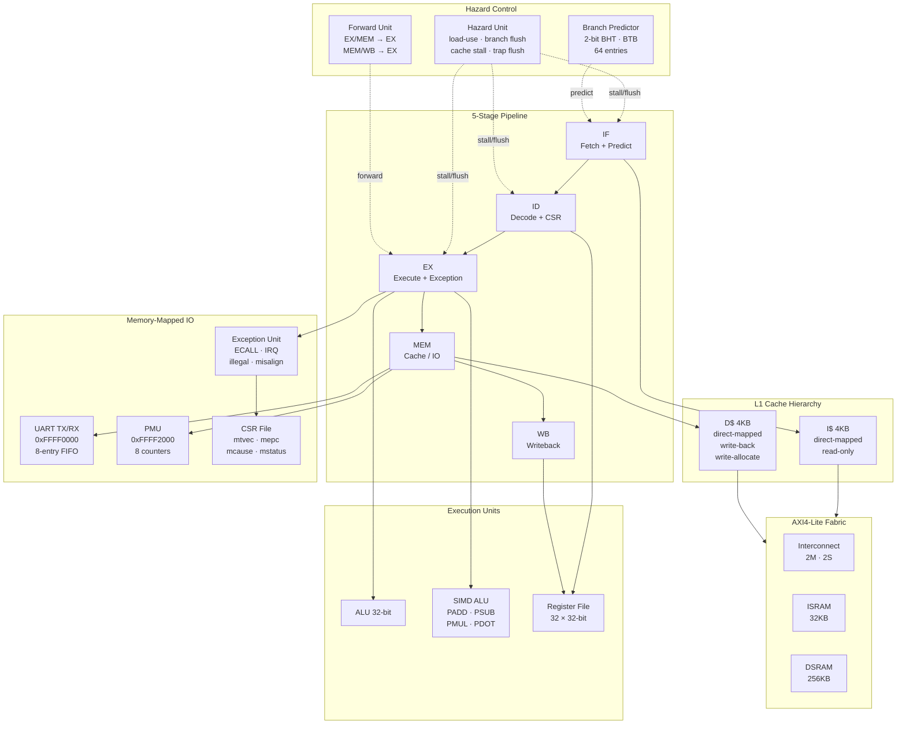

# RV32I RISC-V CPU Core

A complete RV32I RISC-V processor implemented from scratch in SystemVerilog. Features a 5-stage pipeline with full hazard handling, split 4KB L1 cache hierarchy backed by an AXI4-Lite memory fabric, 2-bit branch predictor, M-mode exception handling, memory-mapped UART with TX/RX, hardware performance counters, and custom SIMD extensions benchmarked at **15.6x speedup** on INT8 matrix multiply.

---

## Architecture



---

## Features

### RV32I Base ISA
All 37 base integer instructions across all six formats — R, I, S, B, U, J. Includes arithmetic, logical, shift, branch, jump, and all load/store widths (byte, halfword, word with sign/zero extension).

### 5-Stage Pipeline
- **Data forwarding** — EX/MEM and MEM/WB paths eliminate stalls for most data hazards; EX/MEM takes priority when both paths target the same register
- **Load-use stall** — 1-cycle bubble when a load result is consumed immediately by the next instruction
- **Branch predictor** — 2-bit saturating counter BHT with 64-entry BTB; flushes only on misprediction, not on every taken branch
- **Cache stall** — all five stages frozen during dcache miss; only IF/ID frozen during icache miss with bubble insertion

### L1 Cache Hierarchy
| Cache | Size | Organization | Policy |
|-------|------|-------------|--------|
| Instruction | 4KB | 256 lines × 16 bytes, direct-mapped | Read-only, flush on mispredict |
| Data | 4KB | 256 lines × 16 bytes, direct-mapped | Write-back, write-allocate |

Both caches back onto a custom AXI4-Lite fabric connecting to separate 32KB instruction SRAM and 256KB data SRAM.

### AXI4-Lite Memory Fabric
Separate icache and dcache managers route through an address-decoded interconnect to independent ISRAM and DSRAM subordinates. Harvard architecture maintained throughout: instruction and data paths never share a bus transaction.

### M-Mode Exception Handling
Full trap/return pipeline: ECALL, illegal instruction, load/store misalign, external IRQ. CSR instructions CSRRW, CSRRS, CSRRC with spec-compliant suppression of CSR writes when rs1=x0. MRET returns to mepc.

### UART TX/RX
Memory-mapped at `0xFFFF0000`. 8-entry TX FIFO, 8N1 framing, status register polling. RX path with 2-flop synchronizer, falling-edge start-bit detection, and IRQ output. Verified end-to-end in simulation.

### Hardware PMU
8 read-only counters at `0xFFFF2000`:

| Offset | Counter |
|--------|---------|
| +0x00 | Cycle count |
| +0x04 | Instructions retired |
| +0x08 | Branches executed |
| +0x0C | Branch mispredictions |
| +0x10 | D$ hits |
| +0x14 | D$ misses |
| +0x18 | I$ hits |
| +0x1C | I$ misses |

### Custom SIMD Extensions
Four instructions at RISC-V custom opcode `0001011`, operating on 32-bit registers as packed 4×8-bit vectors:

| Instruction | Operation | Use case |
|-------------|-----------|---------|
| `PADD rd, rs1, rs2` | `rd[i] = rs1[i] + rs2[i]` | Packed 8-bit add |
| `PSUB rd, rs1, rs2` | `rd[i] = rs1[i] - rs2[i]` | Packed 8-bit subtract |
| `PMUL rd, rs1, rs2` | `rd[i] = rs1[i] × rs2[i]` | Packed 8-bit multiply |
| `PDOT rd, rs1, rs2` | `rd = Σ rs1[i] × rs2[i]` | 4-element dot product |

PDOT maps directly to the multiply-accumulate at the core of INT8 neural network inference.

---

## Benchmark Results

4×4 INT8 matrix multiply (A × I = A), measured via hardware PMU:

| Metric | Scalar | SIMD | Notes |
|--------|--------|------|-------|
| Cycles | 4329 | 277 | **15.6× speedup** |
| Instructions | 3051 | 201 | |
| CPI | 1.419 | 1.378 | |
| D$ hit rate | 98.3% | 96.2% | |
| Branch misprediction | 9.6% | 35.0% | Short SIMD loop, predictor not trained |

Scalar uses shift-and-add multiply (RV32I has no MUL). SIMD uses a single PDOT per output element. The speedup comes entirely from instruction throughput — the memory access pattern is identical in both versions.

---

## Memory Map

| Address | Size | Description |
|---------|------|-------------|
| `0x00000000` | 32KB | Instruction SRAM (via I$) |
| `0x00000000` | 256KB | Data SRAM (via D$, separate Harvard path) |
| `0x00001000` | 16B | Matrix A (benchmark) |
| `0x00001010` | 16B | Matrix B transposed (benchmark) |
| `0x00001020` | 16B | Matrix C output (benchmark) |
| `0xFFFF0000` | 4B | UART TX data |
| `0xFFFF0004` | 4B | UART TX status (bit 0 = FIFO not full) |
| `0xFFFF0008` | 4B | UART RX data |
| `0xFFFF000C` | 4B | UART RX status (bit 0 = data valid) |
| `0xFFFF2000` | 32B | PMU counters (8 × 4B) |

---

## Project Structure

```
rv32i-core/
├── src/
│   ├── top_pipeline.sv           # Pipelined top level (main)
│   ├── top.sv                    # Single-cycle top level (regression baseline)
│   ├── program_counter.sv
│   ├── if_id_reg.sv
│   ├── id_ex_reg.sv
│   ├── ex_mem_reg.sv
│   ├── mem_wb_reg.sv
│   ├── register_file.sv
│   ├── alu.sv
│   ├── simd_alu.sv               # PADD PSUB PMUL PDOT
│   ├── control_unit.sv           # All RV32I opcodes + SYSTEM + CSR
│   ├── forward_unit.sv
│   ├── hazard_unit.sv
│   ├── branch_predictor.sv       # 2-bit BHT + BTB
│   ├── dcache.sv                 # 4KB direct-mapped WB/WA
│   ├── icache.sv                 # 4KB direct-mapped read-only
│   ├── axi4_lite_icache_manager.sv
│   ├── axi4_lite_dcache_manager.sv
│   ├── axi4_lite_sram_sub.sv     # Parameterized SRAM subordinate
│   ├── axi4_lite_uart_sub.sv     # UART subordinate (written, pending connection)
│   ├── axi4_lite_interconnect.sv # 2-manager 2-subordinate fabric
│   ├── uart_tx.sv
│   ├── uart_rx.sv
│   ├── uart_mem_map.sv
│   ├── csr_regfile.sv
│   ├── exception_unit.sv
│   └── perf_counters.sv
├── tb/
│   ├── tb_top_pipeline.sv        # Full pipeline integration (12/12)
│   ├── tb_icache.sv              # Icache standalone (29/29)
│   ├── tb_dcache.sv
│   ├── tb_hazard_unit.sv         # (11/11)
│   ├── tb_axi4_lite.sv           # AXI fabric
│   ├── tb_uart_rx.sv
│   ├── tb_exception_test.sv
│   ├── tb_matmul.sv              # Scalar vs SIMD benchmark
│   └── tb_top.sv                 # Single-cycle regression
├── programs/
│   ├── test1.hex                 # Arithmetic, branch, loop
│   ├── test2.hex                 # Memory, logic, LUI
│   ├── exception_test.hex        # ECALL, MRET, CSR
│   ├── matmul_scalar.hex         # 4×4 INT8 matrix multiply, shift-and-add
│   └── matmul_simd.hex           # 4×4 INT8 matrix multiply, PDOT
└── Makefile
```

---

## Getting Started

### Prerequisites

```bash
# macOS
brew install icarus-verilog

# Ubuntu / WSL
sudo apt install iverilog

# Verify
iverilog -V
```

Clone the repository:

```bash
git clone https://github.com/abishekmatevannan-afk/rv32i-core-cpu.git
cd rv32i-core-cpu
mkdir -p sim
```

### Run individual module tests

```bash
make sim MODULE=alu
make sim MODULE=register_file
make sim MODULE=hazard_unit
make sim MODULE=icache
make sim MODULE=dcache
make sim MODULE=simd_alu
make sim MODULE=uart_rx
make sim MODULE=axi4_lite
```

### Run full pipeline integration

```bash
make sim MODULE=top_pipeline    # 5-stage pipeline, test1 + test2
make sim MODULE=top             # single-cycle regression
```

### Run the matrix multiply benchmark

```bash
make sim MODULE=matmul
```

Expected output:
```
Scalar:  4329 cycles  3051 instrs  CPI=1.419
SIMD:    277 cycles  201 instrs  CPI=1.378
Speedup: 15.63x
D$ hit rate: 98.3%
```

### View waveforms

```bash
make wave MODULE=top_pipeline
make wave MODULE=icache
```

---

## Verification

| Module | Tests | Status |
|--------|-------|--------|
| ALU | All operations | ✅ |
| Register file | Dual-read, x0 hardwired | ✅ |
| Control unit | All opcodes, funct3/funct7 | ✅ |
| Forward unit | EX/MEM and MEM/WB paths | ✅ |
| Hazard unit | 11/11 | ✅ |
| D$ cache | Miss, fill, writeback, IO bypass | ✅ |
| I$ cache | 29/29 | ✅ |
| Branch predictor | BHT update, BTB, mispredict flush | ✅ |
| AXI4-Lite fabric | 7 test groups | ✅ |
| UART TX/RX | 8N1 framing, FIFO, IRQ | ✅ |
| Exception handling | ECALL, MRET, illegal, IRQ | ✅ |
| Single-cycle CPU | test1, test2 | ✅ |
| Pipelined CPU | test1, test2, exception, matmul | ✅ |

---

## Known Limitations

- **No FPGA synthesis yet** — target is Xilinx Arty A7 or Nexys A7. FPGA Fmax and LUT count not yet measured.
- **Direct-mapped caches** — conflict misses will occur for working sets that alias to the same cache index. 2-way set associative is the natural next step.
- **UART not yet on AXI4-Lite bus** — `axi4_lite_uart_sub.sv` is written and tested standalone; connecting it requires extending the interconnect to three subordinates and adding a one-cycle IO stall.
- **BTB has no tag bits** — addresses differing by 256 bytes alias to the same BTB entry. Low impact for small programs; real workloads would need tag-based filtering.

---

## Tools

| Tool | Version | Purpose |
|------|---------|---------|
| Icarus Verilog | 11+ | RTL simulation |
| GTKWave / Wavetrace | any | Waveform analysis |
| GNU Make | any | Build automation |
| Python 3 | 3.9+ | RISC-V assembler (`encode2.py`) |
| Git | any | Version control |

---

*2nd year Computer Engineering — Toronto Metropolitan University*
