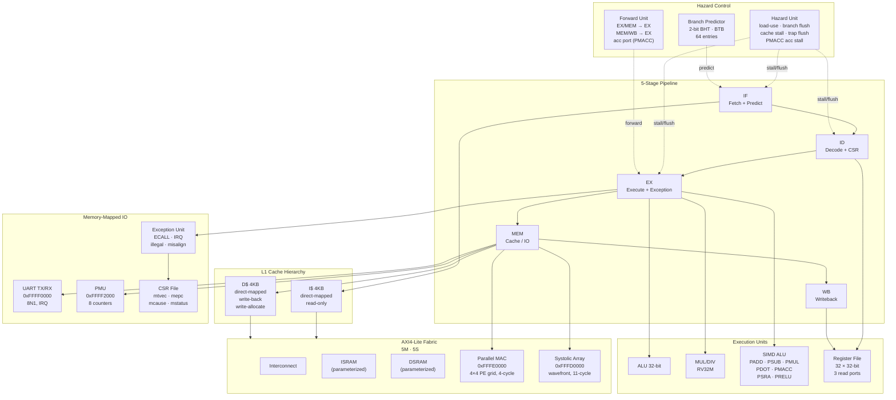
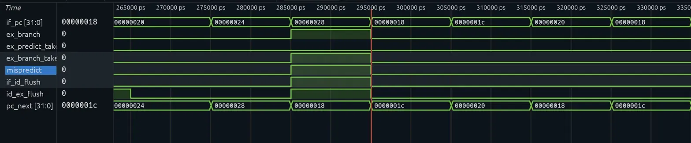
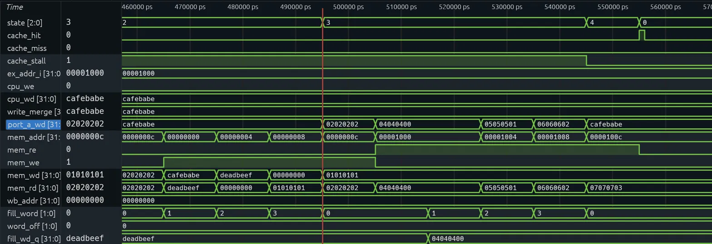
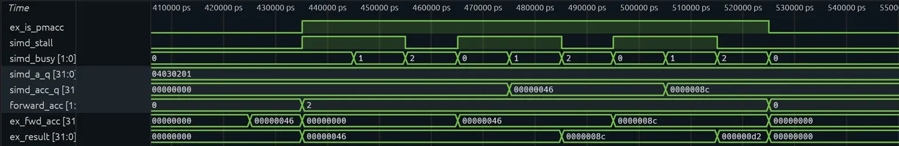
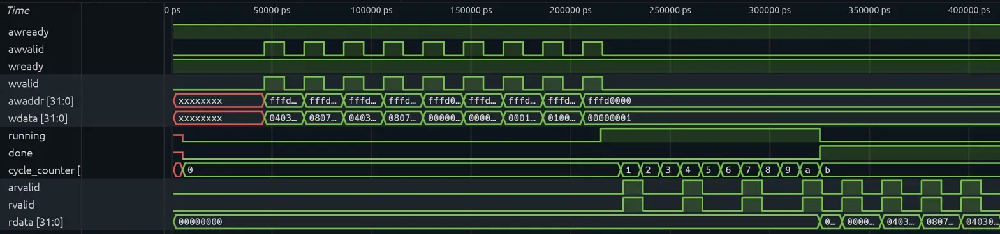

# RV32I+M RISC-V CPU Core

A complete RV32I+M RISC-V processor implemented in SystemVerilog with **up to 13.48× speedup on INT8 matrix multiply** (parallel MAC accelerator), synthesized at **79 MHz** on Xilinx Artix-7 (xc7a200tsbg484-2, Vivado 2025.2). Features a 5-stage pipeline with full hazard handling, split 4KB L1 cache hierarchy backed by a 5-manager/5-subordinate AXI4-Lite fabric, 2-bit branch predictor, M-mode exception handling, memory-mapped UART, hardware performance counters, and two custom accelerators (parallel MAC array and output-stationary systolic array) with custom SIMD extensions. 4×4 INT8 GEMM: **3.63× (SIMD)**, **13.48× (parallel MAC)**, **12.24× (systolic)** vs scalar RV32M · 14,084 LUTs · 1 BRAM.

---

## Architecture



---

## Pipeline in Action

Branch mispredict — the predictor defaults to sequential fetch; when the branch resolves in EX, `mispredict` asserts, `pc_next` redirects to the correct target, and `if_id_flush`/`id_ex_flush` insert two bubbles in the same cycle.



Signals: `if_pc`, `ex_branch`, `ex_predict_taken`, `ex_branch_taken`, `mispredict`, `if_id_flush`, `id_ex_flush`, `pc_next` · scope: `tb_top_pipeline → cpu1` · zoom ~285 ns. Full waveform analysis in the [Waveforms](#waveforms) section.

---

## Features

### RV32I + RV32M Base ISA
All 37 base integer instructions (R, I, S, B, U, J formats). Hardware multiply/divide unit: MUL, MULH, MULHU, MULHSU, DIV, DIVU, REM, REMU — 32-cycle restoring divider, combinational multiplier that maps to DSP48 on Xilinx targets.

### 5-Stage Pipeline
- **Data forwarding** — EX/MEM and MEM/WB paths for rs1/rs2; dedicated acc forwarding path for PMACC (gated on `ex_is_pmacc` to prevent false forwards)
- **Load-use stall** — 1-cycle bubble for load→use; extended to cover PMACC accumulator port (load→PMACC with same rd stalls)
- **Branch predictor** — 2-bit saturating counter BHT with 64-entry BTB; trained on JAL/JALR/branches; flushes only on misprediction
- **Cache stall** — all five stages frozen during D$ miss; IF/ID frozen with bubble on I$ miss

### L1 Cache Hierarchy
| Cache | Size | Organization | Policy |
|-------|------|-------------|--------|
| Instruction | 4KB | 256 lines × 16 bytes, direct-mapped | Read-only |
| Data | 4KB | 256 lines × 16 bytes, direct-mapped | Write-back, write-allocate |

Both caches back onto the AXI4-Lite fabric via dedicated manager modules.

### AXI4-Lite Memory Fabric (5M/5S)
Address-decoded crossbar connecting five managers (icache, dcache, IO, parallel MAC, systolic array) to five subordinates:

| Subordinate | Address | Description |
|-------------|---------|-------------|
| ISRAM | — | Instruction SRAM (read-only, `$readmemh` init) |
| DSRAM | — | Data SRAM (read/write, zero-init) |
| UART | `0xFFFF0000` | UART TX/RX subordinate |
| Parallel MAC | `0xFFFE0000` | 4×4 PE grid accelerator |
| Systolic Array | `0xFFFD0000` | Output-stationary wavefront accelerator |

### M-Mode Exception Handling
Full trap/return pipeline: ECALL, illegal instruction, load/store misalign, external IRQ. CSR instructions CSRRW, CSRRS, CSRRC. MRET restores PC from mepc and re-enables interrupts.

### UART TX/RX
Memory-mapped at `0xFFFF0000` on the AXI4-Lite bus. 8-entry TX FIFO, 8N1 framing, status polling. RX path with 2-flop synchronizer, falling-edge start-bit detection, and IRQ output.

### Hardware PMU
8 read-only counters at `0xFFFF2000`:

| Offset | Counter |
|--------|---------|
| +0x00 | Cycle count |
| +0x04 | Instructions retired |
| +0x08 | Branches executed |
| +0x0C | Branch mispredictions |
| +0x10 | D$ hits |
| +0x14 | D$ misses |
| +0x18 | I$ hits |
| +0x1C | I$ misses |

### Custom SIMD Extensions
Seven instructions at RISC-V custom opcode `0001011`, operating on 32-bit registers as packed 4×8-bit vectors:

| Instruction | funct3 | Operation | Notes |
|-------------|--------|-----------|-------|
| `PADD rd, rs1, rs2` | 000 | `rd[i] = rs1[i] + rs2[i]` | 8-bit unsigned wrap |
| `PSUB rd, rs1, rs2` | 000 | `rd[i] = rs1[i] - rs2[i]` | funct7=0100000 |
| `PMUL rd, rs1, rs2` | 001 | `rd[i] = (rs1[i] × rs2[i])[7:0]` | Lower 8 bits |
| `PDOT rd, rs1, rs2` | 010 | `rd = Σ rs1[i] × rs2[i]` | 32-bit accumulation |
| `PMACC rd, rs1, rs2` | 011 | `rd = rd + PDOT(rs1, rs2)` | rd is src+dst; acc forwarded |
| `PSRA rd, rs1, shamt` | 100 | `rd[i] = rs1[i] >>> shamt` | shamt in funct7[3:0], signed lanes |
| `PRELU rd, rs1` | 101 | `rd[i] = max(0, rs1[i])` | Signed byte interpretation |

**PMACC** reads `rd` as a third source (accumulator), writes back `rd + PDOT(rs1, rs2)`. The register file has a dedicated third read port; the hazard unit and forward unit both handle the accumulator path independently from rs1/rs2.

### Pipeline Verification (SVA)
Four invariants are checked as SystemVerilog assertions at simulation time — synthesizers treat them as no-ops, iverilog evaluates them on every testbench run:

| Assertion | Location | Property |
|-----------|----------|----------|
| Forwarding one-hot | `forward_unit.sv` | `forward_a` and `forward_b` never `2'b11` (undefined mux select) |
| x0 hardwired zero | `register_file.sv` | `regs[0] === 32'd0` on every clock cycle |
| Load-use → stall | `hazard_unit.sv` | `load_use_hazard` implies `if_id_stall` |
| AXI awvalid sticky | `top_pipeline.sv` | awvalid stays high until awready on all 4 AXI channels |

Any violation fires `$error` during simulation; `make test-all` catches it automatically.

### Hardware Accelerators

**Parallel MAC** (`0xFFFE0000`): 4×4 systolic PE grid where all 16 PEs fire in parallel each k-step. Computes a full 4×4 INT8 GEMM in 4 cycles. Supports:
- Tile-K accumulation (CTRL bit 1 preserves `c_acc` across passes for K > 4)
- Requantization: `saturate_uint8((c_acc >> scale_shift) + zero_point)`
- Raw INT32 readback at `0xFFFE0080–0xFFFE00BC`

**Systolic Array** (`0xFFFD0000`): Kung-Leiserson output-stationary wavefront. Compute latency 11 cycles (wavefront fill + drain). Same register map, accumulate mode, and requantization interface as the parallel MAC.

---

## Benchmark Results

4×4 INT8 GEMM (`make sim MODULE=matmul`), measured via hardware PMU:

| Version | Cycles | Instrs | CPI | Speedup |
|---------|--------|--------|-----|---------|
| Scalar (RV32M `mul`) | 1,065 | 835 | 1.275 | 1.00× |
| SIMD (`PDOT`) | 293 | 195 | 1.503 | 3.63× |
| Parallel MAC | 79 | 22 | 3.59 | 13.48× |
| Systolic Array | 87 | 26 | 3.35 | 12.24× |

Instruction counts measured with corrected PMU (`instr_retired` gated by `!mem_wb_stall`; prior versions overcounted during stall cycles).

**Scalar**: hardware `mul` (RV32M), 4×4 triple-nested loop. D$ hit rate 98.3%.  
**SIMD**: load-use stall before each PDOT eliminated by scheduling three independent C-address instructions into the stall slot. D$ hit rate 96.2%. Higher CPI (1.503) reflects two-stall-cycle cost of registered SIMD inputs added for timing closure.  
**Parallel MAC**: 4-cycle PE compute; remaining 57 cycles are AXI4-Lite register writes. High CPI (3.59) is AXI setup overhead dominating a 4×4 problem — amortizes at larger matrix sizes.  
**Systolic Array**: 11-cycle wavefront fill/drain; 61 cycles AXI overhead. Same overhead story as parallel MAC.

**16×16 tiled matmul** (`make sim MODULE=matmul_16x16`): A=B=all-1s (16×16), tiled as 16 output tiles of 4×4 with 4 K-passes each. First K-pass uses CTRL=1 (clears `c_acc`); subsequent three use CTRL=3 (preserve `c_acc`). Result: C[i][j]=16 for all entries (one pass gives 4; four accumulated passes give 16). Proves the INT32 accumulator correctly chains K > 4 passes — the feature exists for exactly the question *"how does your accelerator handle matrices larger than the PE array?"*

---

## FPGA Implementation

**Target:** Xilinx Artix-7 xc7a200tsbg484-2 · **Tool:** Vivado 2025.2 · **Constraint:** 100 MHz

### Fmax Progression

| Step | WNS | Fmax |
|------|-----|------|
| Baseline | -7.787 ns | ~57 MHz |
| `ex_addr_i = ex_alu_result` | -4.467 ns | ~69 MHz |
| `wb_csr_rd` removed | -3.670 ns | ~73 MHz |
| Registered SIMD inputs + 2-cycle stall | -2.730 ns | **~79 MHz** |

### Final Implementation (79 MHz)

| Metric | Value |
|--------|-------|
| Slice LUTs | 14,084 |
| Slice Registers | 5,399 |
| Block RAM Tile | 1 (icache, RAMB36E1) |
| DSP48E1 | 8 (multiplier) |
| WNS | -2.730 ns |
| Failing endpoints | 1,679 / 20,318 |

Critical path: branch predictor BHT → `predict_taken` → `pc_next` mux → icache prefetch address (13.476 ns, 21 logic levels). See `SYNTHESIS.md` for full utilization breakdown and path analysis.

---

## Waveforms

Four captures from the simulation testbenches, each verified signal-by-signal against the VCD before captioning.

### D$ dirty-line eviction and refill (`make wave MODULE=dcache`)



Signals: `cpu_addr`, `cpu_we`, `cpu_wd`, `cache_miss`, `cache_stall`, `state[2:0]`, `mem_we`, `mem_addr`, `mem_wd`, `mem_re`, `mem_rd`. Navigate to `tb_dcache → dut` for `state`.

Dirty-line eviction and refill: on a cache miss to a dirty line, the FSM transitions WB_PREP → WRITEBACK → FILL → DONE, writing back all four words of the evicted line before fetching the new line. Here the dirty line (base address 0x0000) is written back word-by-word with the modified value 0xCAFEBABE correctly appearing at offset 0x0 (word 0, where `write_word(0x0, CAFEBABE)` placed it), then FILL fetches the replacement line from 0x1000–0x100C.

### Branch mispredict redirect and pipeline flush (`make wave MODULE=top_pipeline`)


Signals: `if_pc`, `ex_branch`, `ex_predict_taken`, `ex_branch_taken`, `mispredict`, `if_id_flush`, `id_ex_flush`, `pc_next`. All in `tb_top_pipeline → cpu1`. Zoom to the first mispredict event (~285 ns).

Branch mispredict resolution: the front end fetches sequentially (0x20→0x24→0x28) with no prediction of the branch at 0x28 being taken. When the branch resolves in EX, `mispredict` asserts, redirecting `pc_next` to the true target 0x18 that same cycle, while `if_id_flush` and `id_ex_flush` assert together to clear the IF/ID and ID/EX latches, inserting two bubbles in the same cycle. `if_pc` picks up the corrected address the next cycle. This is the canonical cold-BTB case: no prior BTB entry exists for this branch, so the pipeline defaults to sequential fetch until EX-stage resolution forces the redirect and flush.

### PMACC accumulator forwarding chain (`make wave MODULE=pmacc_pipeline`)



Signals: `ex_is_pmacc`, `simd_stall`, `simd_busy[1:0]`, `simd_acc_q`, `forward_acc[1:0]`, `ex_fwd_acc`, `ex_result`. All in `tb_pmacc_pipeline → cpu`. Zoom to 415–540 ns.

PMACC accumulator forwarding: three back-to-back PMACC instructions execute through the SIMD MAC unit (`simd_busy` cycling 0→1→2 each time). Each instruction's result is forwarded from MEM back into EX via `ex_fwd_acc` before the destination register is written, allowing the next PMACC to accumulate without stalling for a full writeback. The running sum is verified in the trace: **0x46 → 0x8c → 0xd2**, each step correctly using the forwarded total as `acc_in` for the next PMACC.

### Systolic array end-to-end AXI transaction (`make wave MODULE=systolic_array`)



Signals: `awvalid`, `awready`, `wvalid`, `wready`, `awaddr`, `wdata`, `running`, `done`, `cycle_counter[3:0]`, `arvalid`, `rvalid`, `rdata`. All in `tb_systolic_array` top scope.

End-to-end systolic array transaction over AXI: operand matrices are loaded via an 8-beat AXI write burst, after which `running` asserts and the array computes for 11 cycles (`cycle_counter` 0→0xa, asserting `done` when it reaches 0xb). Results are then drained back to the host over an AXI read burst. This capture shows the array's external timing contract; the internal diagonal wavefront fill (PE-to-PE staggered accumulation) is not visible at this signal granularity — capturing that would require testbench instrumentation of the PE generate block (`feed_gen`/`bfeed_gen` scopes), which is left as future work.

---

## Memory Map

| Address | Description |
|---------|-------------|
| `0x00000000` | Instruction SRAM (via I$) |
| `0x00000000` | Data SRAM (via D$, separate Harvard path) |
| `0xFFFF0000` | UART TX/RX (AXI4-Lite subordinate) |
| `0xFFFF2000` | PMU counters (8 × 4B) |
| `0xFFFD0000` | Systolic Array registers |
| `0xFFFD0030` | Systolic SCALE_SHIFT (5-bit) |
| `0xFFFD0034` | Systolic ZERO_POINT (8-bit) |
| `0xFFFD0080` | Systolic C_INT32 readback (16 × 4B) |
| `0xFFFE0000` | Parallel MAC registers |
| `0xFFFE0030` | Parallel MAC SCALE_SHIFT |
| `0xFFFE0034` | Parallel MAC ZERO_POINT |
| `0xFFFE0080` | Parallel MAC C_INT32 readback (16 × 4B) |

---

## Project Structure

```
rv32i-core-cpu/
├── src/
│   ├── top_pipeline.sv              # 5-stage pipeline top level
│   ├── top.sv                       # Single-cycle top (regression baseline)
│   ├── program_counter.sv
│   ├── if_id_reg.sv
│   ├── id_ex_reg.sv                 # includes acc_data for PMACC
│   ├── ex_mem_reg.sv
│   ├── mem_wb_reg.sv
│   ├── register_file.sv             # 3 read ports (rs1, rs2, acc)
│   ├── alu.sv
│   ├── simd_alu.sv                  # PADD PSUB PMUL PDOT PMACC PSRA PRELU
│   ├── mul_div_unit.sv              # RV32M: MUL/DIV/REM
│   ├── control_unit.sv              # All RV32I+M+custom opcodes
│   ├── forward_unit.sv              # rs1/rs2/acc forwarding
│   ├── hazard_unit.sv               # load-use stall, PMACC acc stall
│   ├── branch_predictor.sv          # 2-bit BHT + BTB
│   ├── dcache.sv                    # 4KB direct-mapped WB/WA
│   ├── icache.sv                    # 4KB direct-mapped read-only
│   ├── axi4_lite_interconnect.sv    # 5M/5S address-decoded crossbar
│   ├── axi4_lite_icache_manager.sv
│   ├── axi4_lite_dcache_manager.sv
│   ├── axi4_lite_accel_manager.sv   # shared by both accelerators
│   ├── axi4_lite_io_manager.sv
│   ├── axi4_lite_sram_sub.sv        # parameterized SRAM subordinate
│   ├── axi4_lite_uart_sub.sv        # UART subordinate
│   ├── parallel_mac_sub.sv          # 4×4 PE grid, 4-cycle compute
│   ├── systolic_array_sub.sv        # Kung-Leiserson wavefront, 11-cycle
│   ├── uart_tx.sv
│   ├── uart_rx.sv
│   ├── uart_mem_map.sv
│   ├── csr_regfile.sv
│   ├── exception_unit.sv
│   └── perf_counters.sv
├── tb/
│   ├── tb_top_pipeline.sv           # Full pipeline integration
│   ├── tb_top.sv                    # Single-cycle regression
│   ├── tb_simd_alu.sv               # PADD/PSUB/PMUL/PDOT/PMACC/PSRA/PRELU
│   ├── tb_pmacc.sv                  # PMACC unit test (acc port isolation)
│   ├── tb_pmacc_pipeline.sv         # PMACC pipeline integration (all fwd paths)
│   ├── tb_psra_pipeline.sv          # PSRA/PRELU pipeline integration (all fwd paths)
│   ├── tb_parallel_mac.sv           # Accelerator: baseline, requant, K-tiling
│   ├── tb_systolic_array.sv         # Accelerator: same test suite at 0xFFFD
│   ├── tb_matmul.sv                 # 4-way benchmark (scalar/SIMD/pmac/systolic)
│   ├── tb_matmul_16x16.sv           # 16×16 tiled matmul, proves accumulate mode
│   ├── tb_hazard_unit.sv
│   ├── tb_forward_unit.sv
│   ├── tb_dcache.sv
│   ├── tb_icache.sv
│   ├── tb_axi4_lite.sv
│   ├── tb_uart_rx.sv
│   ├── tb_uart_tx.sv (or tb_uart_mem_map.sv)
│   ├── tb_exception_test.sv
│   ├── tb_exception_handler_stack.sv
│   ├── tb_mul_div.sv
│   └── tb_perf_demo.sv
├── programs/
│   ├── test1.hex                    # Arithmetic, branch, loop
│   ├── test2.hex                    # Memory, logic, LUI
│   ├── exception_test.hex           # ECALL, MRET, CSR
│   ├── matmul_scalar.hex            # 4×4 INT8 GEMM, RV32M mul
│   ├── matmul_simd.hex              # 4×4 INT8 GEMM, PDOT
│   ├── matmul_systolic.hex          # 4×4 INT8 GEMM, systolic array
│   ├── pmacc_test.hex               # PMACC forwarding paths test
│   ├── psra_prelu_test.hex          # PSRA/PRELU forwarding paths test
│   └── matmul_16x16_systolic.hex    # 16×16 tiled matmul, accumulate mode
└── Makefile
```

---

## Getting Started

### Prerequisites

```bash
# macOS
brew install icarus-verilog

# Ubuntu / WSL
sudo apt install iverilog
```

### Run all tests

```bash
make test-all
```

Expected: `34 passed   0 failed`

### Run individual module tests

```bash
make sim MODULE=simd_alu
make sim MODULE=pmacc
make sim MODULE=pmacc_pipeline
make sim MODULE=hazard_unit
make sim MODULE=forward_unit
make sim MODULE=dcache
make sim MODULE=icache
make sim MODULE=parallel_mac
make sim MODULE=systolic_array
make sim MODULE=mul_div
```

### Run the matrix multiply benchmark

```bash
make sim MODULE=matmul
```

Expected output (approximate):
```
Scalar:       1065 cycles   835 instrs   CPI=1.275   1.00x
SIMD:          293 cycles   195 instrs   CPI=1.503   3.63x
Parallel MAC:   79 cycles    22 instrs   CPI=3.59   13.48x
Systolic:       87 cycles    26 instrs   CPI=3.35   12.24x
```

### View waveforms

```bash
make wave MODULE=top_pipeline
make wave MODULE=pmacc_pipeline
```

---

## Verification

| Module | Tests | Status |
|--------|-------|--------|
| ALU | All RV32I operations | ✅ |
| MUL/DIV | RV32M MUL/MULH/DIV/REM variants | ✅ |
| Register file | 3-port read, x0 hardwired | ✅ |
| Control unit | All RV32I+M+custom opcodes | ✅ |
| Forward unit | EX/MEM, MEM/WB, acc (PMACC) | ✅ |
| Hazard unit | load-use, branch flush, PMACC acc stall | ✅ |
| SIMD ALU | PADD/PSUB/PMUL/PDOT/PMACC/PSRA/PRELU | ✅ |
| PMACC unit | acc=0, chain, large INT32 | ✅ |
| PMACC pipeline | All 4 forwarding paths end-to-end | ✅ |
| PSRA/PRELU pipeline | All forwarding paths end-to-end | ✅ |
| D$ cache | Miss, fill, writeback, bypass | ✅ |
| I$ cache | Miss, fill, invalidate | ✅ |
| Branch predictor | BHT update, BTB, mispredict flush | ✅ |
| AXI4-Lite fabric | 5M/5S routing, all subordinates | ✅ |
| Parallel MAC | Baseline, overflow, requant, K-tiling | ✅ |
| Systolic Array | Same suite at 0xFFFD | ✅ |
| UART TX/RX | 8N1 framing, FIFO, IRQ | ✅ |
| Exception handling | ECALL, MRET, illegal, IRQ, stack save/restore | ✅ |
| Performance counters | All 8 counters via PMU | ✅ |
| 16×16 tiled matmul | Accumulate mode (CTRL bit 1), 4 K-passes → C[i][j]=16 | ✅ |
| Single-cycle CPU | Regression baseline | ✅ |
| Pipelined CPU | test1, test2, exception, matmul | ✅ |
| SVA assertions | forwarding one-hot, x0 invariant, load-use→stall, AXI awvalid sticky (all 4 channels) | ✅ |
| **Total** | **34 testbenches** | **34/34** |

---

## Known Limitations

- **Direct-mapped caches** — conflict misses for working sets that alias to the same cache index. 2-way set associative is the natural next step.
- **Direct-mapped BTB** — 64 entries indexed by PC[7:2]; a new branch evicts the old entry at the same index. The tag check (PC[31:8]) prevents wrong-path redirects but cannot prevent a high-traffic entry from being evicted by a colliding PC.
- **FPGA synthesis** — Fmax, critical path analysis, and utilization breakdown in `SYNTHESIS.md`. Known timing and BRAM inference gaps in `Known_limitations.md`.
- **dcache BRAM inference** — `data[]` maps to distributed RAM (RAM64M×176) instead of RAMB36E1. Write-hit forwarding creates a combinational loop that prevents unconditional BRAM read inference. See `Known_limitations.md`.

---

## Tools

| Tool | Version | Purpose |
|------|---------|---------|
| Icarus Verilog | 11+ | RTL simulation |
| Wavetrace (VS Code) | any | Waveform analysis |
| Vivado | 2025.2 | Synthesis and implementation (see `SYNTHESIS.md`) |
| GNU Make | any | Build automation |
| Git | any | Version control |

---

*3rd year Computer Engineering — Toronto Metropolitan University*
