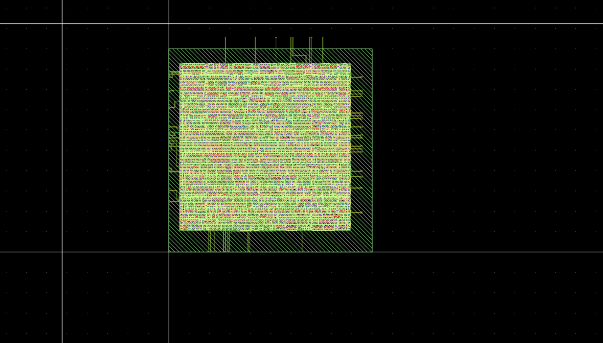

# ASIC Flow: LibreLane + Sky130 130nm

Two designs taken through an open-source ASIC flow to compare with the FPGA implementation in Vivado. 

**Note on tooling:** OpenLane 2 was renamed to LibreLane in early 2026, and it's
the same codebase and backward-compatible. Commands below use `librelane`, not
`openlane`.

---

## Designs

### `alu/`: zero-risk first pass
The RV32I ALU (`src/alu.sv`). Is purely combinational 32-bit ADD/SUB/AND/OR/XOR/shifts/SLT, Which has no sequential state (`CLOCK_PORT: null`), so it was used only to validate
the toolchain.

**Result:** Antenna, LVS, and DRC all passed clean. However, one item got flagged (`1 XOR
difference`), which was confirmed to be harmless and didnt affect anything. Both the ALU run and the pe_cell run below
produce the same single-shape mismatch on GDS layer `235/4` (`prBoundary.boundary`),
a non-fabrication placement/routing marker layer where Magic and KLayout's GDS
stream out tools disagreed on rendering, so it isn't a real issue. Setup timing
violations on this run are also a config artifact rather than a legitamite result to consider,
due to a purely combinational design still getting a virtual clock from
`CLOCK_PERIOD`, and the ALU's actual delay exceeding the placeholder period. That
wasn't worth fixing and improving since the ALU run's only purpose was proving the toolchain actually worked.

### `pe_cell/`: portfolio piece



A single output-stationary PE extracted from the 4×4 parallel MAC accelerator
(`src/pe_cell.sv`). It is sequential where an 8×8 multiplier feeds a 32-bit accumulator
register on every enabled cycle. This is the building block tiled 16 times in the
hardware accelerator.

The RTL was verified  before touching LibreLane via `make sim MODULE=pe_cell`, which
ran 7 of 7 passing tests, including a PDOT cross-validation against the full
pipeline testbench (expected 70, confirmed 70) and a signed/unsigned
discriminator. Feeding `a=0xFF, b=0x02` and getting 510 confirms the module
uses zero-extension and unsigned multiply, matching the original
`parallel_mac_sub.sv` compute loop, since a signed version would have
produced -2 instead.

**Clock constraint:** 16 ns (62.5 MHz). See "What the timing result actually
shows" below for why this is the number and why it isn't a clean pass.

---

## Setup

### Prerequisites
- Docker Desktop (macOS or Linux)
- ~20 GB free disk (image + PDK)

### Pull and start the toolchain

The correct image is `hpretl/iic-osic-tools`, pulled through the project's own
launch scripts.

```bash
git clone --depth=1 https://github.com/iic-jku/iic-osic-tools.git
cd iic-osic-tools
./start_shell.sh
```

This mounts a design directory (auto detected, and shown in the script's own
output as "Design directory auto-set to...") into the container at
`/foss/designs`. Use `./start_shell.sh` for everything below, since it's a
plain terminal with working copy and paste. Only use `./start_vnc.sh` (which
opens a browser-based desktop at `http://localhost:80`) when you actually need
KLayout's GUI to view a GDS file.

Copy this repo into that mounted design directory from your host machine, not
from inside the container:
```bash
cp -r /path/to/rv32i-core-cpu /path/to/mounted/designs/
```

### Install LibreLane inside the container
```bash
pip install --upgrade librelane
librelane --version
librelane --smoke-test
```
A passing smoke test ends with `Smoke test passed.` along with clean Antenna/LVS/DRC checks. Warnings about thread count, IO placement defaults, or
`VSRC_LOC_FILES` are expected on the given example design and don't indicate
an issue, so do not worry.

---

## Running the flow

From `/foss/designs/rv32i-core-cpu` inside the container:

```bash
librelane asic/alu/config.json
librelane asic/pe_cell/config.json
```

Results land in `asic/<design>/runs/RUN_<timestamp>/`.

---

## What the timing result actually shows

The pe_cell closes cleanly at typical (`tt`) and fast-process (`ff`) corners at
16 ns (62.5 MHz), with zero setup violations and positive slack. It does
**not** close at the slow-process/high-temperature (`ss`) corner with the worst slack
across the three `ss` sub-corners being **-0.370 ns** (nominal: -0.220 ns, min: -0.123 ns, max: -0.370 ns).

 The critical
path (from `report_checks` at `max_ss_100C_1v60`) runs from an input operand
bit (`b[7]`) through the multiplier's partial-product reduction tree
(`maj3`/`xnor2`/`xor2` gates, the carry-save-adder signature) and directly into
the accumulator's carry-propagate adder chain (`a211oi`/`o31ai`/`nor2`/`o311ai`/
`and4` gates), landing on the accumulator's flip-flop, which is the entire 8×8 multiply feeding the 32-bit add as one unbroken combinational path in a single
cycle, the expected bottleneck for a single-cycle MAC design.

**Ruled out as alternate explanations, and how:**
- *Floorplan congestion.* A larger die (150×150, 35% utilization) was tested against the same 16 ns target, and worst-corner slack got measurably *worse* (-0.483 ns vs. -0.370 ns) instead of improving, which rules out routing congestion as the issue. T
- *Clock-period sweep not converging linearly.* Slack improved from -4.35 ns
  (10 ns period) to -0.370 ns (16 ns), then got *worse* at 17 ns (-0.567 ns).
  That behavior, combined with the congestion test above,
  shows the remaining gap is caused by a fixed gate delay through the multiply/add chain rather than anything a looser clock or more floorplan room can solve.

**A solution (not yet implemented):** pipeline the multiply and the
accumulate into two separate cycles by registering the multiplier's output
before it feeds the adder, which breaks the single-cycle critical path at that
boundary. 

**One caveat on the absolute number:** the critical path's first ~3.2 ns,
roughly 20% of the 16 ns budget, is a fixed input external delay that comes
from LibreLane's generic fallback SDC, since no `PNR_SDC_FILE` or
`SIGNOFF_SDC_FILE` was defined for this run. A real sign-off would set this deliberately, and doing so could
change the reported number in either direction.

---

## Key output files

| File | What it tells you |
|------|-------------------|
| `runs/.../final/gds/*.gds` | GDSII, opened in KLayout (`klayout <file>.gds`), VNC mode only |
| `runs/.../final/nl/*.v` | Gate-level netlist after technology mapping |
| `runs/.../*/metrics.json` | All run metrics in one file, including timing (`timing__setup__wns__corner:*`), DRC/LVS/antenna counts, and power |
| `runs/.../55-openroad-stapostpnr/<corner>/checks.rpt` | Full critical-path breakdown (startpoint, endpoint, cell-by-cell delay) for that corner |

### Numbers pulled for this README and the main project README
From `RUN_2026-09-08_00-57-59` (the 100×100 / 50% utilization / 16 ns config,
matching the final verified settings):

- **Cell count:** 1,081 standard cell instances
- **Cell area:** 6,831.55 µm²
- **Die area:** 10,040.4 µm² (target was 100×100 = 10,000 µm², and a small margin adds the rest)
- **Actual utilization:** ~68% (cell area divided by die area), higher than the 50% `FP_CORE_UTIL` target, since that setting is a placement target rather than a guaranteed final result

**Note on KLayout's technology display:** this container's KLayout only has
`sg13g2` (IHP's separate 130nm PDK, also bundled in this image) and a generic
`default` registered as selectable viewer technologies, meaning `sky130A` isn't in
that list. Because of that, KLayout's toolbar and layer panel show raw numeric
layer pairs (e.g. `64/5`) instead of proper sky130 layer names, and the
technology selector may still display "sg13g2" regardless of the actual PDK
used. This was confirmed to be a viewer and display gap in the container's KLayout setup, and not
a flow issue. The geometry itself is confirmed to be valid sky130A output through
the LibreLane run's own DRC and LVS checks, which already validated it
against the real sky130 rule deck and standard cell library before this
screenshot was ever taken.

---

## FPGA vs. ASIC, and what changes

| | FPGA (Vivado, Artix-7) | ASIC (LibreLane, Sky130) |
|---|---|---|
| Synthesis target | LUT4/6 + flip-flops + DSP48 | Standard cells (AND/OR/FF/MUX, etc.) |
| Place & route | Vendor tool, fixed fabric grid | Free-form standard-cell P&R |
| Timing sign-off | Vivado STA (vendor SDF) | OpenSTA with RC extraction, multi-corner (PVT) |
| Output | Bitstream | GDSII (send to fab) |
| Multiplier | DSP48E1 (hard block) | Synthesized from standard cells |
| Logic resources | 14,084 LUTs (full CPU, FPGA fabric-wide) | 1,081 standard cells, 6,831.55 µm² (pe_cell alone, so not  comparable since it's a full design vs. a single extracted module) |
| Result | 79 MHz (10 ns constraint, -2.730 ns WNS after 3 critical-path fixes) | Closes at 62.5 MHz (16 ns) for typical and fast-process corners, and falls 0.370 ns short at the worst-case slow-process corner |

**Why the FPGA number is higher, and why that's a real result
rather than a discrepancy:** the FPGA's hard DSP48E1 block
performs the 8×8 multiply as dedicated silicon with a 
pre characterized fast path, so no synthesized gate tree is involved. The
ASIC flow has to build the equivalent multiplier out of Sky130's standard
cells, and Sky130 is a 130nm process, older than what modern FPGA
fabrics are built on. A modern FPGA's hard multiplier block outperforming an
open-source flow's synthesized multiplier on an older process node is a
legitimate and explainable outcome, not a sign that either result is wrong.